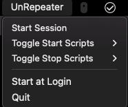
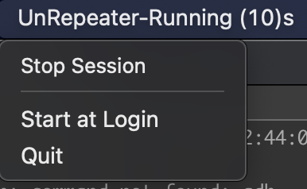

# Un Repeater (for mac only)

When you don't want to repeat your most mundane tasks again. Un Repeater provides simple control from status bar.
Run a bunch of scripts without switching tabs, by simply clicking from status bar.

### Ergonomic benefits (personal opinions though)
- You don't have to switch the tab or window. You do 2 less `Cmd + Tab` presses every time.
- Minimises visual context switching and keeps your focus intact.

## How it works
1. Drop your scripts in scripts folder and make sure they are numbered
    - Place start related scripts in `scripts/start-hooks` folder
    - Place stop related scripts in `scripts/stop-hooks` folder
    - Also,  
        - if you want to run start/stop hook scripts in non block mode, simply suffix it with `.noblock`  
            E.g: If a certain script blocks and if we still want to execute subsequent numbered scripts  
        - if you want to skip a start/stop hook script from execution, simply suffix it with `.skip`  
2. Run the program from CLI `SESSION_ROOT="session-data" go run main.go`. Where $SESSION_ROOT refers to folder in which collected session details will be preserved
3. From status bar, you can start or stop a session
4. Start & stop scripts are also listed in the menu dropdown. You can selectively enable/disable certain script.

## Screenshots

### Start session from status bar

### Stop session from status bar

## Roadmap
- Support for notifications
- Configurability using status bar Menu
- External configuration
- CLI support
- Icon support
- Installable binary
- Pre defined templates for scripts
- Multi platform support
